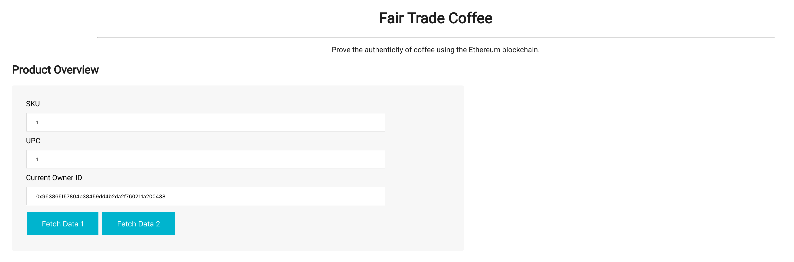

# Coffee SupplyChain

Truffle v5.0.2 (core: 5.0.2)
Solidity v0.5.0 (solc-js)
Node v12.1.0


https://rinkeby.etherscan.io/address/0x0c955197099344f4f8288f685d0d852d6028f7c7#code

⚠️  Important ⚠️
If you're using an HDWalletProvider, it must be Web3 1.0 enabled or your migration will hang.


Migrations dry-run (simulation)
===============================
> Network name:    'rinkeby-fork'
> Network id:      4
> Block gas limit: 10000000


1_initial_migration.js
======================

   Deploying 'Migrations'
   ----------------------
   > account:             0x7127e81801D313591b63Bc07341C61245AA0CF5C
   > balance:             18.71975889
   > gas used:            269908
   > gas price:           10 gwei
   > value sent:          0 ETH
   > total cost:          0.00269908 ETH

   -------------------------------------
   > Total cost:          0.00269908 ETH


2_deploy_contracts.js
=====================

   Deploying 'FarmerRole'
   ----------------------
   > account:             0x7127e81801D313591b63Bc07341C61245AA0CF5C
   > balance:             18.71542834
   > gas used:            406021
   > gas price:           10 gwei
   > value sent:          0 ETH
   > total cost:          0.00406021 ETH


   Deploying 'DistributorRole'
   ---------------------------
   > account:             0x7127e81801D313591b63Bc07341C61245AA0CF5C
   > balance:             18.71136493
   > gas used:            406341
   > gas price:           10 gwei
   > value sent:          0 ETH
   > total cost:          0.00406341 ETH


   Deploying 'RetailerRole'
   ------------------------
   > account:             0x7127e81801D313591b63Bc07341C61245AA0CF5C
   > balance:             18.70730152
   > gas used:            406341
   > gas price:           10 gwei
   > value sent:          0 ETH
   > total cost:          0.00406341 ETH


   Deploying 'ConsumerRole'
   ------------------------
   > account:             0x7127e81801D313591b63Bc07341C61245AA0CF5C
   > balance:             18.70324003
   > gas used:            406149
   > gas price:           10 gwei
   > value sent:          0 ETH
   > total cost:          0.00406149 ETH


   Deploying 'SupplyChain'
   -----------------------
   > account:             0x7127e81801D313591b63Bc07341C61245AA0CF5C
   > balance:             18.6651772
   > gas used:            3806283
   > gas price:           10 gwei
   > value sent:          0 ETH
   > total cost:          0.03806283 ETH

   -------------------------------------
   > Total cost:          0.05431135 ETH


Summary
=======
> Total deployments:   6
> Final cost:          0.05701043 ETH

⚠️  Important ⚠️
If you're using an HDWalletProvider, it must be Web3 1.0 enabled or your migration will hang.


Starting migrations...
======================
> Network name:    'rinkeby'
> Network id:      4
> Block gas limit: 10000000


1_initial_migration.js
======================

   Deploying 'Migrations'
   ----------------------
   > transaction hash:    0x0ee46d3c7e5b27b36ba7670434caa8254d309f43956ebfece590d61a1036d8bc
   > Blocks: 0            Seconds: 12
   > contract address:    0x4bEAb46c2B505950bE9287e8E458bc4d983C64A6
   > account:             0x7127e81801D313591b63Bc07341C61245AA0CF5C
   > balance:             18.72001161
   > gas used:            244636
   > gas price:           10 gwei
   > value sent:          0 ETH
   > total cost:          0.00244636 ETH


   > Saving migration to chain.
   > Saving artifacts
   -------------------------------------
   > Total cost:          0.00244636 ETH


2_deploy_contracts.js
=====================

   Deploying 'FarmerRole'
   ----------------------
   > transaction hash:    0xc14ec7ba3d45ed92a5a9b8d93a87d711771896bc252e191815cef6dfd627ad22
   > Blocks: 0            Seconds: 12
   > contract address:    0x4F30Be3F0A11bc382b660e104BECAFD5F1Cec20D
   > account:             0x7127e81801D313591b63Bc07341C61245AA0CF5C
   > balance:             18.71616646
   > gas used:            342141
   > gas price:           10 gwei
   > value sent:          0 ETH
   > total cost:          0.00342141 ETH


   Deploying 'DistributorRole'
   ---------------------------
   > transaction hash:    0x08ad8dde93e601e11a812209f006a429eafdc22e2efc63d091dffbb646c57bbe
   > Blocks: 0            Seconds: 8
   > contract address:    0x3368F6069F4A47e1dd3F56EebcCe41d3A013fde9
   > account:             0x7127e81801D313591b63Bc07341C61245AA0CF5C
   > balance:             18.71274445
   > gas used:            342201
   > gas price:           10 gwei
   > value sent:          0 ETH
   > total cost:          0.00342201 ETH


   Deploying 'RetailerRole'
   ------------------------
   > transaction hash:    0x729b311599b460b5f1864fa5e8517fc7a5ca6031eb3cf4981bd67799801f6f72
   > Blocks: 0            Seconds: 8
   > contract address:    0xFB5f26225C1AA8bAd0AC81CbB5dEC3101EC06846
   > account:             0x7127e81801D313591b63Bc07341C61245AA0CF5C
   > balance:             18.70932244
   > gas used:            342201
   > gas price:           10 gwei
   > value sent:          0 ETH
   > total cost:          0.00342201 ETH


   Deploying 'ConsumerRole'
   ------------------------
   > transaction hash:    0xbbce64992462159b0fcf87cb0b81ac5adc23c0da12f45b9a9169eea5e99a8f59
   > Blocks: 0            Seconds: 12
   > contract address:    0x17a4301B8c1b8fECcB2a31eEC712D1Da808d7128
   > account:             0x7127e81801D313591b63Bc07341C61245AA0CF5C
   > balance:             18.70590079
   > gas used:            342165
   > gas price:           10 gwei
   > value sent:          0 ETH
   > total cost:          0.00342165 ETH


   Deploying 'SupplyChain'
   -----------------------
   > transaction hash:    0x53212135a14eb928ce2712a0274d1040e21689d675fa7bfaee59198761b255df
   > Blocks: 0            Seconds: 12
   > contract address:    0x0c955197099344F4F8288F685D0d852d6028f7C7
   > account:             0x7127e81801D313591b63Bc07341C61245AA0CF5C
   > balance:             18.67357168
   > gas used:            3232911
   > gas price:           10 gwei
   > value sent:          0 ETH
   > total cost:          0.03232911 ETH


   > Saving migration to chain.
   > Saving artifacts
   -------------------------------------
   > Total cost:          0.04601619 ETH


Summary
=======
> Total deployments:   6
> Final cost:          0.04846255 ETH


# Supply chain & data auditing

This repository containts an Ethereum DApp that demonstrates a Supply Chain flow between a Seller and Buyer. The user story is similar to any commonly used supply chain process. A Seller can add items to the inventory system stored in the blockchain. A Buyer can purchase such items from the inventory system. Additionally a Seller can mark an item as Shipped, and similarly a Buyer can mark an item as Received.

The DApp User Interface when running should look like...




## Getting Started

These instructions will get you a copy of the project up and running on your local machine for development and testing purposes. See deployment for notes on how to deploy the project on a live system.

### Prerequisites

Please make sure you've already installed ganache-cli, Truffle and enabled MetaMask extension in your browser.

```
Give examples (to be clarified)
```

### Installing

A step by step series of examples that tell you have to get a development env running

Clone this repository:

```
git clone https://github.com/udacity/nd1309/tree/master/course-5/project-6
```

Change directory to ```project-6``` folder and install all requisite npm packages (as listed in ```package.json```):

```
cd project-6
npm install
```

Launch Ganache:

```
ganache-cli -m "spirit supply whale amount human item harsh scare congress discover talent hamster"
```

Your terminal should look something like this:


In a separate terminal window, Compile smart contracts:

```
truffle compile
```

Your terminal should look something like this:


This will create the smart contract artifacts in folder ```build\contracts```.

Migrate smart contracts to the locally running blockchain, ganache-cli:

```
truffle migrate
```

Your terminal should look something like this:


Test smart contracts:

```
truffle test
```

All 10 tests should pass.


In a separate terminal window, launch the DApp:

```
npm run dev
```

## Built With

* [Ethereum](https://www.ethereum.org/) - Ethereum is a decentralized platform that runs smart contracts
* [IPFS](https://ipfs.io/) - IPFS is the Distributed Web | A peer-to-peer hypermedia protocol
to make the web faster, safer, and more open.
* [Truffle Framework](http://truffleframework.com/) - Truffle is the most popular development framework for Ethereum with a mission to make your life a whole lot easier.


## Authors

See also the list of [contributors](https://github.com/your/project/contributors.md) who participated in this project.

## Acknowledgments

* Solidity
* Ganache-cli
* Truffle
* IPFS
